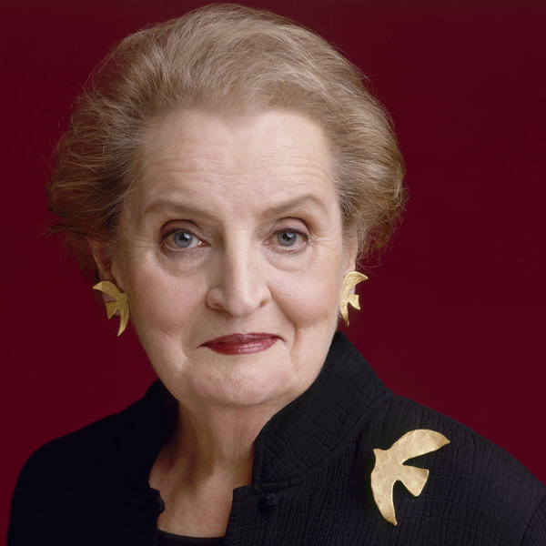

> It took me quite a long time to develop a voice, and now that I have it, I am not going to be silent.

Wise words from the kick-ass woman this sprint is devoted to. Madeleine Albright was born in Prague, where she spent the first part of her life until her folks fled Hitler, then Stalin (evidently being an advocate for democracy wasn't very popular there). And where did she end up state-side: Colorado, of course (I hear some pretty cool people are from there 😄). And, what she's most recognized for is her appointment as the first female Secretary of State. But, what I didn't know, is that she made a diplomatic visit to North Korea for some face time with Kim Jong Il (first Secretary of State to visit). Sure beats the heck out of nuclear-sized pissing contest with his son, amirite?

Last, she's the inspiration to Leslie Knope, friends with the wonderful HRC, and makes this guy have just a little more respect for the misspelling of my daughter's name 😆 (Madeline)!
