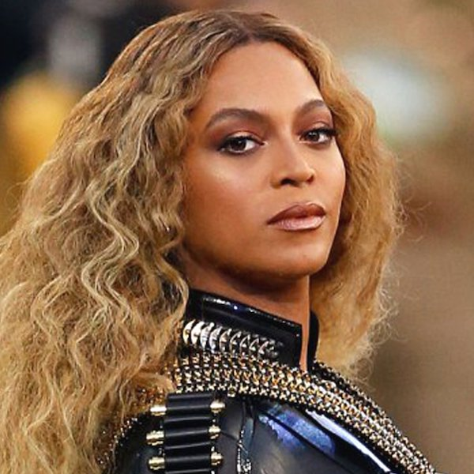

> If everything was perfect, you would never learn and you would never grow.

A long time ago, in a city far away, a nervous, shy kid stepped onto a stage in a middle school auditorium for the Mr. PMS pageant (Pickens Middle School, not a great acronym) dressed in a baseball uniform carrying a bat. I don't recall why I was wearing what I was wearing (was it the "athletics" portion of the show?), but I do remember walking onto the stage with the chorus of Survivor (by Destiny's Child) blaring over the loud speaker. Fast forward to last week, where my 4yo sits in the back seat singing along to Halo (one of our favs).

**Beyoncé**, the kick-ass woman of our current sprint, needs little introduction. She is the Queen Bey, and she's built an empire around a voice that's made her one of the best-selling music artists ever (22 Grammy's, 24 wins at the VMAs). And, she's used her platform not only for herself, but also to become an activist for racial injustice, same sex marriage, feminism, and more. Last, she's given away millions of her cash to those those in need (some went to Hurricane Katrina, Goodwill, Haiti, etc). She definitely deserves 👏👏👏 and a sprint named in her honor.
