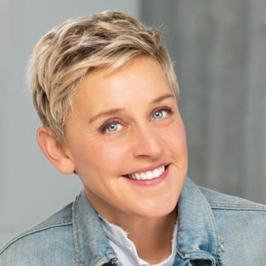

> We use 10% of our brains. Imagine how much we could accomplish if we used the other 60%.

My daughter loves her some Ellen. Well, she mostly loves Dory, but I think it still counts. Our kick-ass woman of the E sprint is Ellen Degeneres (was sooo tempted to write this bio about Ellen Nicole Dover, but alas, she's more of the kick-ass woman in my life, not this sprint per se 😆). Ellen Degeneres is a comedian, an actress, a talk show host, an author (she's written 4 books), and the owner of a record company. That is all.

I kid, I kid. Ya'll, I grew up in rural South Carolina in the 90s, and it was rough. The word "gay" was weaponized on the daily, a derogatory synonym of "different" that paralyzed my earlier years. I say that to say, I couldn't imagine what it must've been like to be born a lesbian woman in the pre-civil rights South (she's from LA, and I don't mean California). Anyway, Ellen came out in 1997, first on Oprah, followed by her sitcom. Since then, she met her partner, Portia de Rossi, who she married in 2008, and has been a staunch advocate for the LGBTQ community. And, I know she's not the sole factor here, but her public declaration of her truth was the first of it's kind, and did a lot to shape the landscape of mass media.

So, as you watch the latest episode of Queer Eye (episode 2 is about a software engineer 🙌) or Everything Sucks (This one has some 90s nostalgia that I ❤️), remember it's because of folks like Ellen who push the needle forward to provide better representation for all of us.
