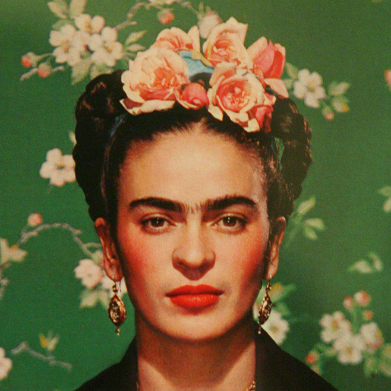

> Feet, what do I need you for when I have wings to fly?

Our lady of kick-assery for the F sprint is Frida Kahlo. Frida, if you are unfamiliar, was an artist from Mexico who's subject matter was a bit biographical, mixed with some surrealism / magical realism. It drew a lot from her personal life, which was marked by a few challenging things: She was diagnosed w/ polio as a child, which left her disabled; She was also injured in a traffic accident in her late teens, that left her with pain and medical problems for the remainder of her life.

Now, the typical but somewhat tragic part of this story is that Frida was commonly overshadowed by her husband (Diego Riviera, also an artist) and didn't really reach the fame she deserved until much later. However, starting in the 1970s, her work was rediscovered and she became an icon for Chicanos (i.e. Mexican civil rights), feminists, and the LGBT community (she identified as bisexual).

Today, she lives on through a large volume of work honoring her: She's been the focal point of Frida, a 2002 biopic of her life; she made a cameo in Coco (great movie for kids & adults alike); and, she's been very well represented in recent art (just Google Frida...this one is my fav: https://bit.ly/2wYrcXd -- if any of you want to buy me a random, pricy gift 😆). Not only that, she appears on the 500 peso note. How cool is that!?
