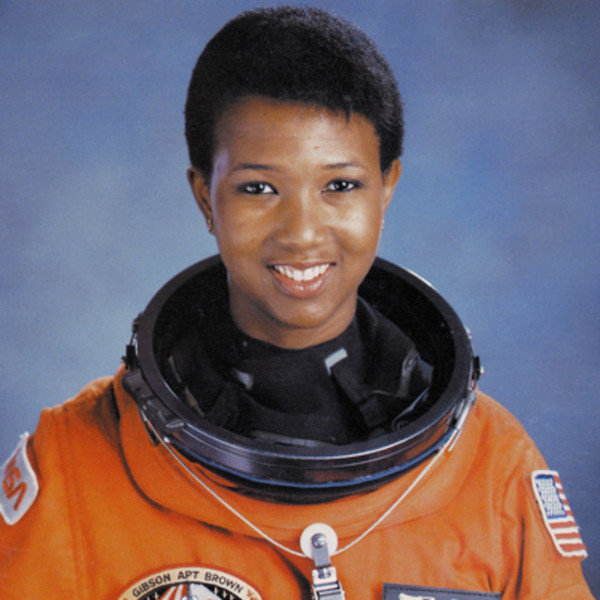

> When I'm asked about the relevance to Black people of what I do, I take that as an affront. It presupposes that Black people have never been involved in exploring the heavens, but this is not so. Ancient African empires - Mali, Songhai, Egypt - had scientists, astronomers. The fact is that space and its resources belong to all of us, not to any one group.

It's hard for me to think of space without thinking of "Space Oddity" (in case you're unaware, https://spoti.fi/2oSWwlL). And I can't help but think how odd it is that a majority of NASA's astronauts are white dudes. That's why I'm honored to tell about Mae Jemison, NASA's first African American female astronaut. 

Even in her early life, Mae assumed she'd get into space, considering it an inevitability by now. She said that she was inspired by MLK, understanding that his dream was not an elusive fantasy, but a call to action. With that in mind, it's unsurprising that Mae was a determined child. In kindergarten, she told her teacher she wanted to be a scientist, and rejected the corrective career path suggested to her: "Don't you want to be a nurse?" Outside of science, Jemison loved dancing, and eventually choreographed a musical in college, at Stanford. Oh, yeah, she also started college at the age of 16, and received a BS in Chemical engineering and BA in African and Afro-American Studies.

Mae went on from Stanford, to Cornell, where she received her MD. During that time, she also took lessons in modern dance. How one can sustain enough energy to go through med school and have some left over for dance is beyond me! After med school, Mae joined the Peace Corp, and later worked with the CDC doing vaccine research.

After the flight of Sally Ride in 1983, Jemison felt it was time for her to take a leap, so she applied to the astronaut program. Although delayed by the Challenger disaster in '86, Mae was accepted into the astronaut program in 1987, and had first space mission in 1992, where she geeked out making Star Trek references, and took along some things of personal importance: a dance theater poster.

After the mission, in 1993, Mae resigned from NASA, saying "I left NASA because I'm very interested in how social sciences interact with technologies."...ah, my kindred spirit. She's since been a professor, a writer, and has been an active public speaker, and has used her platform to inspire a new generation of thinkers (maybe not "free" thinkers per se) to take action (a related quote I love: "Martin Luther King...didn't just have a dream, he got things done.")
