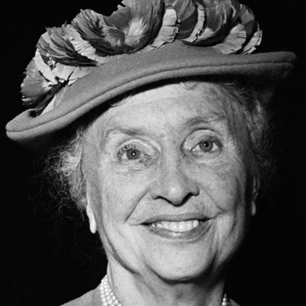

> The best and most beautiful things in the world cannot be seen or even touched - they must be felt with the heart.

I'll admit, I was reluctant to write this report (which is why it's ~2 weeks late). Things are a bit busy, and I'm just not feeling it. Then I thought, if those are my only obstacles, I'm a in a pretty good spot. The kick-ass woman of this sprint is no stranger to obstacles. Helen Keller spent most of her life (she became ill at 19 months) both deaf and blind, but that didn't stop her from being an author, a political activist, and a lecturer.

Helen's early life consisted of using signs with a single person, Martha Washington (the six-year-old daughter of the family cook). By the age of seven, she (and her family) learned more than 60 signs to better enable communication. It's worth mentioning that Keller was also able to determine who was approaching by the vibrations of their footsteps (which is pretty amazing). At some point in her childhood, her parents decided to get her more help. They consulted with Alexander Graham Bell, and was referred to an institute that recommended Anne Sullivan.

Anne Sullivan was responsible for helping Keller understand the concept that every object has a unique word describing it, which seems no easy skill to attain for someone both blind and deaf. The cool part of this was that Keller eventually understood what Anne was trying to teach her, with the example of water: After running water on Keller's hand, and making motions similar to running water on Keller's palm, Keller connected the symbol of the thing with the thing itself. This served as the starting point for Keller's upward trajectory in her life.
