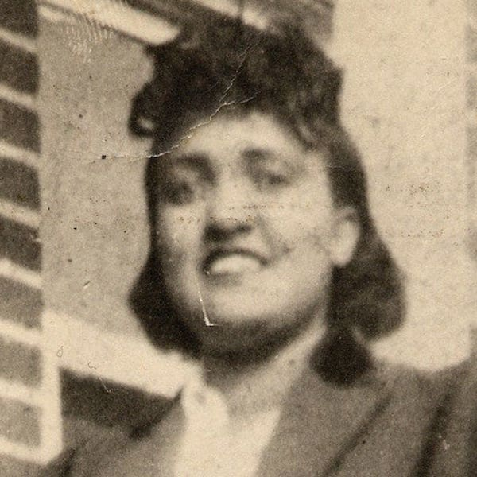

Our kick-ass woman of this sprint is Henrietta Lacks, an individual who had cancer cells that became the source of the HeLa cell line, the first immortalized cell line (which means it'll reproduce indefinitely under certain conditions).

Lacks was born in Roanoke, VA in 1920 to Eliza and Johnny Pleasant, and ended up living with her grandfather at the age of four (her mom died while giving birth to her 10th child, her father was unable to care for the children alone). It was there that she met her future husband, David Day Lacks. They worked together on a tobacco farm, had their first child, were married, and moved to Turner Station, one of the oldest and largest African-American communities in Baltimore County at that time.

While in Maryland, Lacks had her other 4 children. Shortly after the birth of her fifth child, Lacks went to the hospital because she felt she had a "knot" in her womb. This lead to her later diagnosis of cervical cancer, where a biopsy was taken, which became the source of the HeLa cell line.

Lacks died in 1951, but a tiny part of her lived on, and did amazing things for humanity. Her cell line lead to the polio vaccine, have increased our understanding of cancer, hiv / aids, and cells in general. They've also been used in tons of research since. The problem here was that no consent was given to use the cells for research, no consent was given to share the family's medical records, and no consent was given when the DNA sequence of the genome of a strain of HeLa cells was published.

However, sometimes things do get better, and people are appropriately recognized. In 2013, Lacks' family made a deal with the NIH that gave them more control over access of the DNA sequence, along with a promise of acknowledgement in scientific papers. Not only that, a book (that was later turned into a movie) was written about Henrietta and her contributions to science, and countless other sources have been telling her story (RadioLab did a podcast on this a bit ago - https://overcast.fm/+Jz_Ass).

Anyway, her unwitting contributions have been responsible for a great deal of scientific progress, and I'm glad I got to share a little of her life with you.
