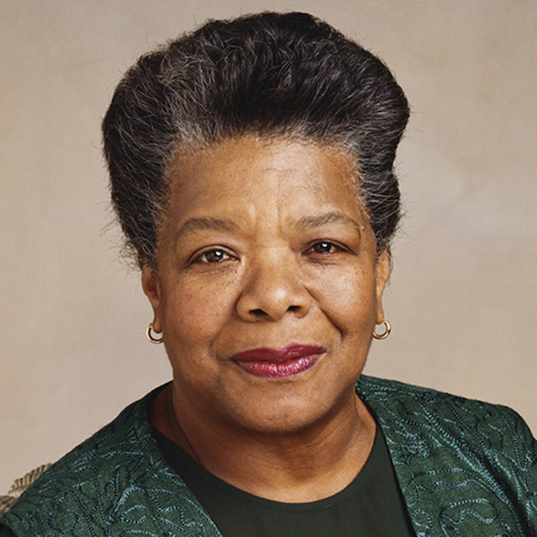

> Each of us brings to our job, whatever it is, our lifetime of experience and our values.

Our kick-ass lady of this sprint is Sandra Day O'Connor, the first woman to have served on the supreme court.  This was the result of a pledge made by Ronald Reagan in his 1980 presidential campaign - one of the better decisions the man made. And of course, there was a bit of backlash on this decision by the populous, because Reagan was a republican, and republicans aren't very well known as champions of women in positions of power. She was confirmed by the senate in 1981 with a unanimous vote, served on the supreme court for 25 years (wow!), and was awarded the Presidential Medal of Freedom (2009) as a result of the years of service she devoted to this country.

During her tenure on the supreme court, O'Connor was the deciding vote on several cases, including cases in which: She voted against _reverse discrimination_ (like that's even a thing, smh); she ended Gore's hopes of becoming president (Bush v. Gore, 200); and, she joined the majority holding that the use of school vouchers for religious schools did not violate the First Amendment's Establishment Clause. In addition, she is a proponent of a stronger separation of church and state, believing that prayer and the pressure to stand in silence at school functions coerced individuals to support something they may not believe in. And of course, she has said she wouldn't overrule Roe v. Wade...it's hard to believe this is a thing we still debate about. Last, she's an advocate of judicial independence, which is something that was and is "under serious attack at both the state and national level."

Her body of work, in a lot of ways, has well illustrated the idea that decisions are _not_ black and white, that there's a lot of gray areas (something I feel that's being lost as we move into a more hyper-partisan future). It's this nuance, and this understanding that O'Connor is an individual whose views are continually evolving based on her "lifetime of experience and ... values," that resonates most deeply with me, that encourages me to look to her as an influential, kick-ass woman who deserves our recognition.
