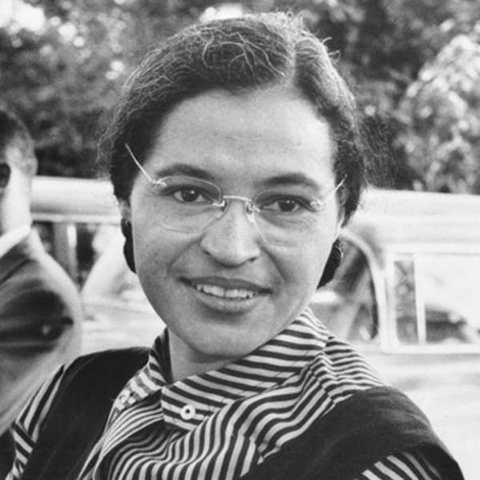

> I have learned over the years that when one's mind is made up, this diminishes fear; knowing what must be done does away with fear.

Rosa Parks was born in the Jim Crow south (Tuskegee, Alabama, 1913) to Leona and James McCauley. As can be expected, her early life provided awareness of the injustice around her. On recalling her elementary school days, she stated "I'd see the bus pass every day...but to me, that was a way of life; we had no choice but to accept what was the customer" (black students had to walk to school). And although she recounts the kindness of some white strangers, she was often the victim of bullying by white kids in her neighborhood. However, this bullying was met with retaliation. Parks, as we know, was not afraid to defend herself.

As Rosa came into adulthood, she became active in the civil rights movement, joining the NAACP, and eventually attending Highlander Folk School, an education center for activism in workers' rights and racial equality. In this  period of her life, she was surrounded by injustice towards people of color, one prominent case being that of Emmett Till, who was brutally murdered in Aug 1955 after reportedly flirting with a white woman. Shortly after attending a meeting discussing this case (late Nov 1955), Rosa found herself on a bus.

On December 1, 1955, with Emmett Till on her mind (she later said "I thought of Emmett Till and I just couldn't go back."), Parks refused to give up her seat to a white passenger, and was arrested. This moved the Women's Political Council (WPC) to step in, and organize a boycott that lasted over a year, and served as the tipping point of the civil rights movement. As a result of Parks decision, she faced a lot of hardship: She lost her job; her husband was pressured to quit his job; and, she constantly received death threats.

I know nothing I'll ever write will adequately capture the greatness of Rosa Parks. She was truly a remarkable human. I'll end by paraphrasing something I read recently (in "The Tipping Point" by Malcolm Gladwell - there are copies in the office). It was Rosa Parks act of defiance that started the Montgomery Bus Boycott, which was a tipping point in the civil rights movement that moved people to rally around Martin Luther King, Jr. (he was initially reluctant to be the figurehead of the movement), which inevitably lead to the Civil Rights Act of 1964.

Parks provided the inspiration for a movement that started us down a path of fighting injustice based on one's race, color, religion, gender, sex, or nationality. It's not a solved problem, but it's in this freedom that: A movement like Black Lives Matter can gain traction and can seek justice for people of color (and thereby, all of us - a nice quote from Nikkita Oliver, a BLM activist in Seattle: "My generation is taking on the torch of a very age old fight for black liberation, but also, liberation for everyone. Injustice anywhere is still injustice everywhere."); we can elect (and bemoan the parting of) our first black president; a presidential candidate can rise and be the first to have the boldness to encourage white folks to understand their privilege in order to better the future of all people.

In short, Parks simple act of defiance changed the world, and we benefit from the legacy of her efforts daily. It's an honor to celebrate her this sprint.
