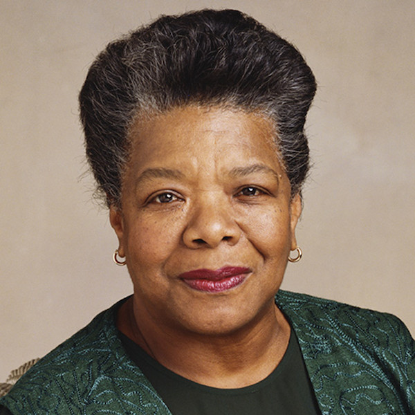

> There is no reason why the aeroplane should not open up a fruitful occupation for women. I see no reason they cannot realize handsome incomes by carrying passengers between adjacent towns, from parcel delivery, taking photographs or conducting schools of flying.
Any of these things it is now possible to do.

Harriet Quimby, our kick-ass woman of this sprint, was an aviator and writer. In her career at Leslie's Illustrated Weekly, she worked as a theater critic, publishing more than 250 articles in a nine-year period. During that time, she attended Belmont Park International Aviation Tournament, which lead to an interest in aviation.

From there, Quimby's interest lead her to take her pilot's test, where she became the first US woman to earn the Aero Club of America aviator's certificate. Her friend Matilde, who she met at Belmont Park, soon followed and became the second. Quimby also authored seven / screenplays that were made into silent film shorts, acted in one of those movies, became the spokesperson for a grape soda (Vin Fiz), and of course, she took flight a time or two.

In 1912, Quimby took off from Dover, England (great name for a town) en route to Calais, France, making her the first woman to pilot an aircraft across the English channel. That said, her flight took place a day before the sinking of the Titanic (thus, media coverage was focused elsewhere).

Unfortunately, the ending of this story comes just three months after her English channel flight, as her aircraft unexpectedly pitched forward, resulting in her ejection from the plane.

That said, it was her rebellion of the status quo, and her determination (she said "This attitude made me more determined than ever to succeed" after witnessing doubt from spectators before she took her English Channel flight) that helped set a precedent for female aviators everywhere.
