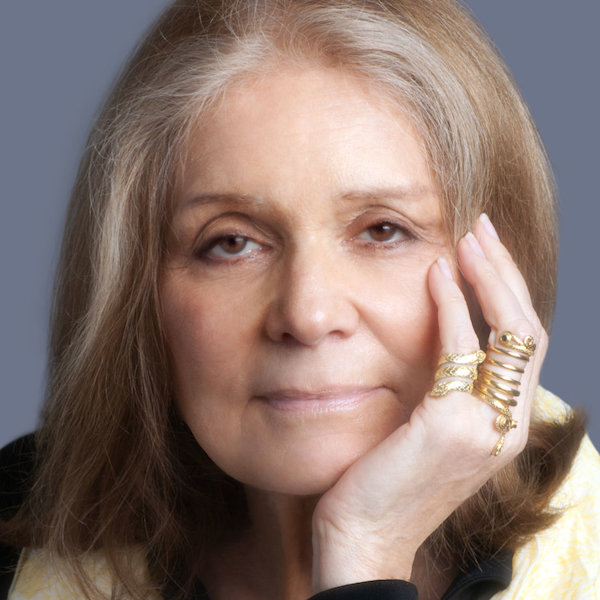

> Men tend to get more conservative because they gain power as they age, and women get more radical because they lose power as they age.

I was recently talking with a family member who told me I was "such a sweet husband" because I cooked dinner that evening. Part of me, of course, was happy because it was a nice thing to hear, but the other part wondered...would she've said a similar thing to my wife? To the best of my understanding, the answer would have surely been no, because sexism, no matter how low-key it may be, is still very much a part of our culture. That said, a key to lessening this sexism is awareness, and a lot of that awareness comes through feminism. And, it's hard to talk about that subject without mentioning a pioneer of the American feminist movement, the kick-ass woman of the S sprint, Gloria Steinem.

Gloria got her career start as a journalist, already a feminist at heart [1](#1). Her first "serious assignment" was about contraception, where she illustrated a world in which women are forced to choose between a career and marriage. This career eventually lead her to an assignment where she took up employment as a Playboy Bunny, and later published "A Bunny's Tale," a look at the exploitive working conditions of others who shared this title [2](#2). Her career in journalism was chocked full of stories like this, far too many to list. But, it was ["After Black Power, Women's Liberation"](http://nymag.com/news/politics/46802/) that brought her to national fame as a a feminist leader.

This lead her to campaign for the Equal Rights Amendment (she testified before the Senate Judiciary Committee in its favor in 1970), lead her to co-found the National Women's Political Caucus (NWPC), lead her down a path of making this world a bit more fair for women (the amount of things she's done is both inspiring and overwhelming to summarize).

That said, a world that is more fair for women doesn't mean one that is unjust to men. Increasing equality is always a net win, always lifts everyone up. This, I would expect, would be an obvious statement, but when I see a quote like "If somebody can be brought down by accusations like this, then you, me, every man certainly should be worried," [3](#3) I realize we still have a lot of progress to be made.

Anyway, Gloria helped start us down this path and is continuing to change the minds of those willing to listen. I know she's been a strong influence in my life, and I'm hoping that translates to a better tomorrow for all of us.

1.  I would assume _most_ women are naturally feminists. That said, I've met several women who've rejected the feminism movement entirely, which is unexpected, and a bit disheartening.
2.  A quick google search for "A bunny's tale" links you to some PDFs, just in case you're curious.
3.  From a hilarious satirical piece, ["Every man should be worried. At least, I’m worried."](https://www.washingtonpost.com/news/opinions/wp/2018/09/17/every-man-should-be-worried-at-least-im-worried/?noredirect=on&utm_term=.2c461a9de524)
4.  Gloria also wrote ["Feminists and the Clinton Question"](https://www.nytimes.com/1998/03/22/opinion/feminists-and-the-clinton-question.html) in 1998, which is something I want to read primarily because NYT removed it from their site / search

