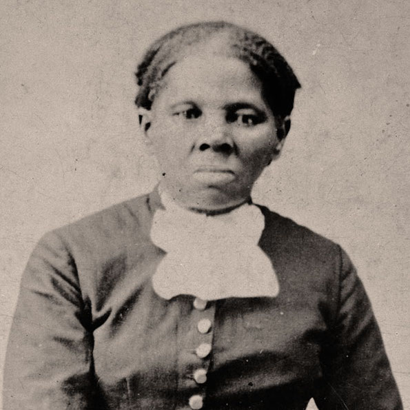

> Every great dream begins with a dreamer. Always remember, you have within you the strength, the patience, and the passion to reach for the stars to change the world.

You ever heard the expression "sucks to be you." It's this flippant thing you hear from time to time when people are more concerned with their lives than those around them. This is the antithesis of our kick-ass woman of the T sprint, Harriet Tubman.

Harriet Tubman was born into slavery, in Maryland. She escaped to Pennsylvania in 1849, and lived out the remainder of her life in a free state. See how lame that story was. Yeah, she didn't do that. She immediately returned to Maryland to rescue her family. Then, **once she rescued her family, she guided dozens of other slaves to freedom on the Underground Railroad.** And, she had a 100% success rate, never losing a "passenger." Then, when the fugitive slave act was passed, she helped guide passengers into British North America (i.e. modern day Canada & the Pacific Northwest). She was referred to as "Moses," guiding our most vulnerable _home_.

As a modern day "Moses," Tubman rescued slaves by night, going virtually undetected. However, her work became more public when she joined the Civil War. She started out as a cook and a nurse, then became an armed scout and spy. She was the **first woman to lead an armed expedition in the war**, which resulted in the liberation of more than 700 slaves. Tubman was an activist in the women's suffrage movement, and spoke out on the sacrifices women have made throughout history as grounds for equality between women and men.

On a final note, Tubman was a devout Christian, part of the AME Zion Church (TIL learned that means African Methodist Episcopal Zion Church). When she was dying, she was surrounded by friends and family, and just before her death, she told those in the room: "I go to prepare a place for you."

That warmth expressed in her final moments, her life of helping others in this life and whatever comes next, is such a beautiful expression of what it means to be compassionate and determined to do the right thing, and it's one of the many reasons why Tubman is the _perfect_ choice for the T sprint.
