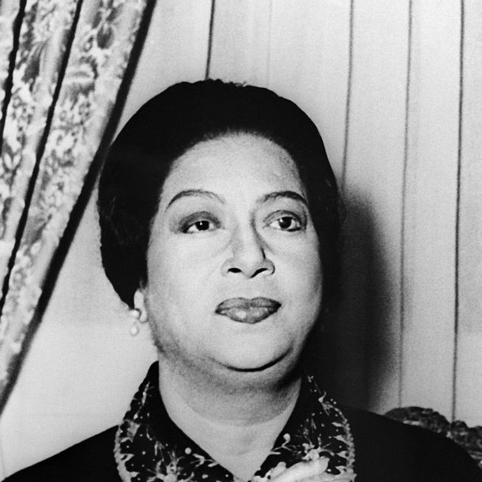

> Love appears in the eyes of the one who loves.

Umm Kulthum (أم كلثوم‎) is the kick-ass woman of the U sprint. Known as the the Kawkab El Sharq (Planet Of The Orient), Kulthum was an Egyptian entertainer known for her abilities as a singer, songwriter, and actress.

Umm was known for her exceptional vocal abilities, and was one of the greatest / most influential singers of the 20th century (she sold over 80 million records worldwide). There's a fair selection of her music on [Spotify](https://open.spotify.com/artist/52lsD82iOqGtyfEMqWgk4f?si=ig4sGqF5Qs2eri64mM9p4Q) if you want to give it a listen.

And, although Kulthum is no longer with us (she died in 1975), her records continue to sell about a million copies a year. Additionally, the Egyptian government opened the Kawkab al-Sharq (Star of the East) Museum in 2001 in her memory.
