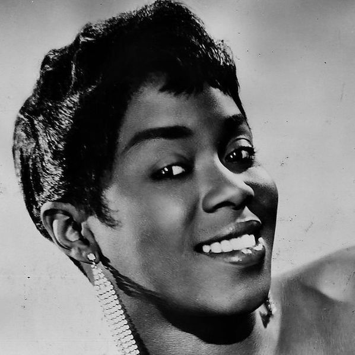

> When I sing, trouble can sit right on my shoulder and I don't even notice.

At the end of a work day, somewhere between a glass of wine and dinner, we usually turn on our [old stereo](https://imgur.com/a/Rf6kWhG) to play [Coffee Table Jazz](https://open.spotify.com/playlist/37i9dQZF1DWVqfgj8NZEp1) or [Lo-Fi Beats](https://open.spotify.com/playlist/37i9dQZF1DWWQRwui0ExPn). Our stereo has the limitation of being generally pop-averse (the 60+ year old speaker can't quite keep up), but it plays jazz wonderfully, and has been playing quite a bit of [Sarah Vaughan](https://open.spotify.com/artist/1bgyxtWjZwA5PQlDsvs9b8) lately. Sarah "Sassy" Vaughan, "The Divine One," is the kick-ass woman of the V sprint, and rightly so. Her smooth voice and amazing vocal range make her easily one of the best vocal jazz musicians of of all time.

Sarah was born in 1924, to a mother who sang in a church choir and a father who played guitar and piano. It's no surprise that she quickly found an interest in music. As a teenager, she snuck into night clubs to play piano and sing, and eventually dropped out of high school when her desire to be a performer outweighed her academic interest.

And, although I'd not advise that path for, it seemed to pay off for Vaughan. Soon after her nights in Newark's night clubs, she began frequenting the Apollo Theater in Harlem with friends. There, she entered the Amateur Night contest, and won. And, while at Apollo Theater, Vaughan came into her own and sang alongside Earl Hines, a band leader and pianaist. This relationship turned into a career which eventually lead her to go solo, and use her vocal talents to land he four Grammy Awards and the Lifetime Achievement Award.

Sarah Vaughan was an amazing vocalist, and her music is always a good go-to to provide a sense of warmth / comfort in our home. I couldn't agree more with the words of Garry Giddins in his book _Visions of Jazz_: "No matter how closely we dissect the particulars of her talent...we must inevitably end up contemplating in silent awe the most phenomenal of her attributes, the one she was handed at birth, the voice that happens once in a lifetime, perhaps once in several lifetimes."