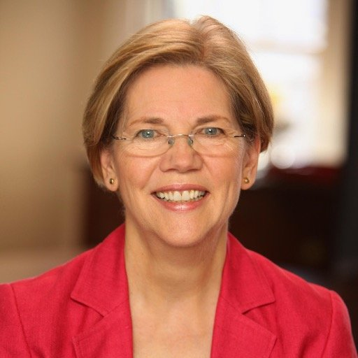

> Americans are fighters. We're tough, resourceful and creative, and if we have the chance to fight on a level playing field, where everyone pays a fair share and everyone has a real shot, then no one - no one can stop us.

The kick-ass woman of the W sprint is everyone's favorite Native American, Elizabeth Warren. I kid, I kid. As a product of upstate South Carolina, and my family's proximity to the Cherokee reservation, I've several family members who have claimed Native American ancestors. Turns out, 23 And Me shakes that up a bit, which is an interesting thing to witness ("in this round of opinion meets fact..." 😆). 

Anyway, Elizabeth Warren is, as most of you know, a senator from Massachussets. She became the first female senator from Massachussets after winning the general election on my 26th birthday (Nov 6. 2012), and has made a name for herself (and had names assigned to her by #45 😒) in the senate. She's a leading figure in the democratic party and has served as the assistant and Special Advisor to the Secretary of the Treasury under Barry O (that's Obama, ya'll). 

But, her story didn't begin in government work. Liz was born in Oklahoma back in the 40s, and was the 4th child of Pauline and Donal Jones Herring. She grew up in Oklahoma, which surely influences her down to earth, no nonsense, matter of fact attitude (I ❤️ mid-westerners…they’re the best). As Warren reached adulthood, she worked at IBM (who was a subcontractor to NASA) and graduated from University of Houston w/ a BS in speech pathology and audiology. And, upon moving to New Jersey (her husband got a job that moved them there), she enrolled in Rutgers Law School, got her J.D., and worked from home (she wrote wills and real estate closings).

Random fact I didn’t know: Warren voted Republican up until 1995, because she though Republicans were those who best supported markets. This is my _in_ to bridge the gap with family when she runs for the office of President 😁. On that note, there’s some speculation that she’ll run for President in 2020 (currently unconfirmed). I sure hope so, because we could use something a bit different than what we’re stuck with now. 

So, here’s to looking forward to 2020, and hoping Warren broadens the scope of her awesomeness just a bit further.