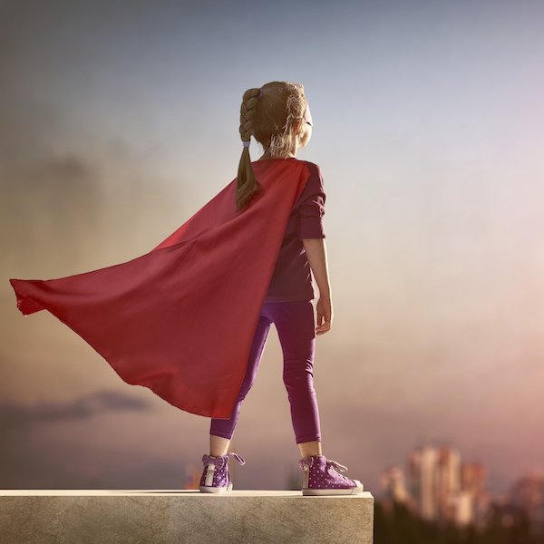

> When there are no ceilings, the sky's the limit. So let's keep going — let's keep going until every one of the 161 million women and girls across America has the opportunity she deserves to have.

This project, started as a response to the recent backlash against women, minorities, and anything that's not white and male, sought to identify women who've changed the world for the better. We highlighted some spectacular women who've accomplished more in a few years than I'll accomplish in a lifetime, and I'm so thankful I've taken the opportunity to learn a bit more about the stories and lives of women I'd previously not known.

There are millions of women not represented in this year's sprints, and that's what the X sprint is dedicated to. Sure there are the obvious ones we've missed: Obama (Michelle), Rihanna, Clinton (Hillary). That said, there are countless others who have or will change this world to make it a bit better, a bit more fair for all of us.

There's a certain joy I derive from this quote by Maya Angelou...

"I love to see a young girl go out and grab the world by the lapels. Life's a bitch. You've got to go out and kick ass."

And I think that pretty adequately sums up all of these women. They're already kick-ass, their accomplishments are already amazing. And the fact that they've made such great strides in a world that's historically treated them unfairly makes them even more admirable.
