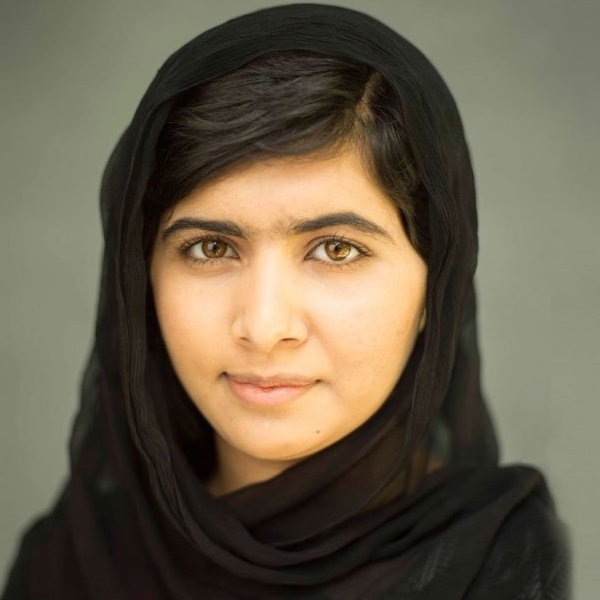

> We realize the importance of our voices only when we are silenced.

The kick-ass woman of the Y sprint is Malala Yousafzai. Her story goes like this.

She grew up in Swat valley in Pakistan. She attended a school her father had founded. Around 2008, the Taliban began attacking girls' schools in Swat, and Malala decided to give a speech, at the age of 12. Like, I was busy playing with legos and watching Spongebob at 12, and this girl was giving a talk title, "How dare the Taliban take away my basic right to education?" The disparity in our reality in the US vs other parts of the world is ridiculous. Anyway, I digress.

So, obviously, this made some "men" a little less than happy, which lead to 2012. In October of that year, she was riding a bus home from school when a masked gunman boarded the bus and demanded to know who Malala was. The gunman, at seeing some of the other kids looking over at Malala, decided to shoot her. Ya'll, she was in critical care, she was put in a medically induced comma, things were bleak. But, she survived.

And she didn't back down or shy away from her deeply held beliefs that women deserved equal education. She continued her advocacy. She spoke before the UN in 2013, and met with Barack Obama. And where I would've just been thankful to share the same space with Barry, Malala took the opportunity to confront him on his use of drone strikes in Pakistan. Oh, and on her 18th birthday, she opened a school in Lebanon for Syrian refugees 🤯. This, after she was awarded the Nobel Peace Prize at 17 years old (the youngest person to ever receive it).

Wow!
