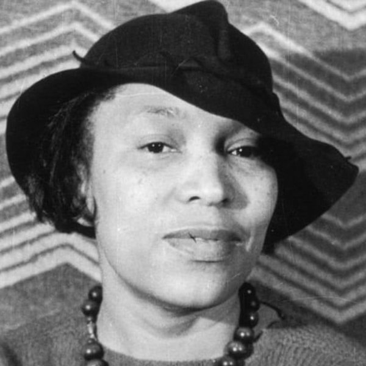

> No matter how far a person can go the horizon is still way beyond you.

Zora Neal Hurston is the kick-ass woman of the Z sprint. She was born at the turn of the 19th century, one of the 8 children of John Hurston (a baptist preacher and carpenter) and Lucy Ann Hurston (a teacher). She grew up in Alabama, but soon moved to Eatonville, Florida. Something I learned: Eatonville was on of the first all-black towns incoporated in the United States.

It's with fondness Zora recalls Eatonville, a place where African Americans could live as they desired, independent from white society. This served as the backdrop of some of her stories, and influenced her greatest known work, Their Eyes Were Watching God.

As these things go, her stories didn't gain a lot of traction until much later. She died in 1960, and it was the March 1975 issue of Ms. Magazine that brought greater public attention to her work (in a piece titled "In Search Of Zora Neale Hurston" by Alice Walker - as in, "The Color Purple").

The Eyes Were Watching God is now regarded as a seminal work in African-American and women's literature. It explored themes of race, women's liberation, and gender roles between men and women.

There's a ton more to her story, but there are two things to highlight in closing. First, you never know the reach of what you do, and how many people it will influence and for how long. Second, when you see someone worthy of recognition (as Alice Walker did), it's your duty to make sure they receive it.
